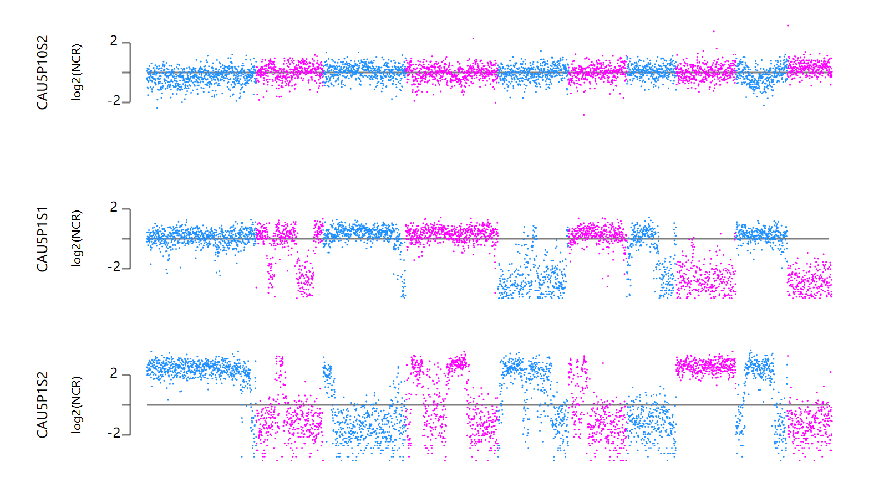

# SinglePollenCNV
Single Pollen chromosome deletion analysis

  

Li X, Meng D, Chen S, et al. Single nucleus sequencing reveals spermatid chromosome fragmentation as a possible cause of maize haploid induction[J]. Nature communications, 2017, 8(1): 991.

